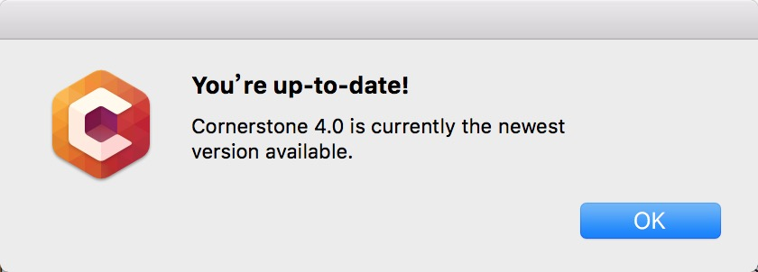
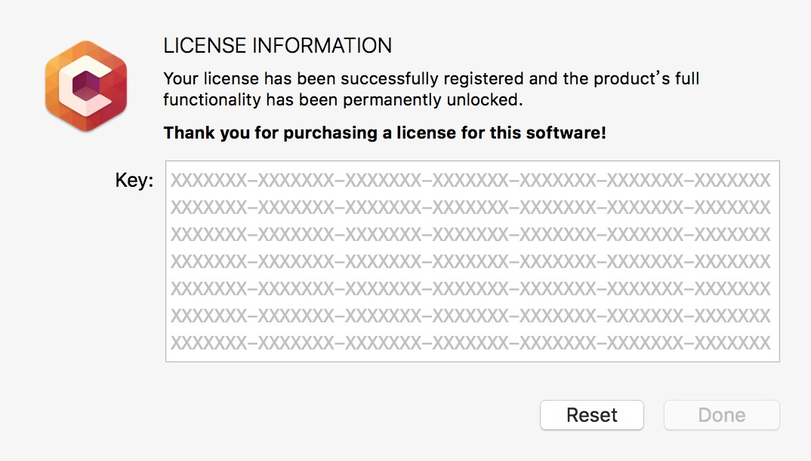

# Cornerstone破解

[Cornerstone](https://cornerstone.assembla.com/) 最新版(4.0)破解。The ultimate Subversion client for Mac just got better with Shelving, Checkpointing, and blazing fast performance..       
2:CornerstoneI.app 为成果物。这里我们构造了一个.app，里面有hook的dylib，通过启动这个app完成对Cornerstone的无侵入hook。之所以这么做而不是insertdylib到可执行文件，是因为Cornerstone还在持续更新。

